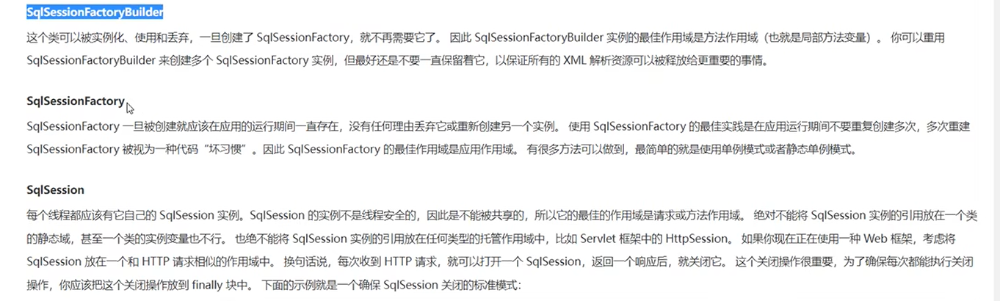

## 子类不能抛出比父类更加广泛的异常  实现类抛出  接口也得抛

sqlSession、sqlSessionFactory、sqlSessionFactoryBuilder  作用域和生命周期

mybatis强制规定用dao接口的权限类名做nameSpace，方法名做sqlId是因为
强制规定的  因为开发框架的人员不知道你的sqlId是啥，且他底层需要这个sqlId获取这个sql标签是什么类型的
所以只能强制规定  必须是dao接口的权限类名加方法名

底层是这么写的，需要去获取完整的sqlId，然后去帮我们实现接口的实现类