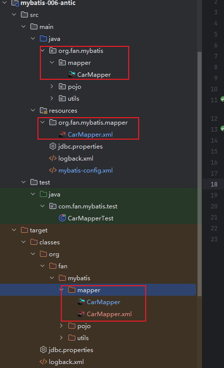

## mybatis小技巧  $#{}区别

**#{}**
DEBUG o.apache.ibatis.transaction.jdbc.JdbcTransaction - Setting autocommit to false on JDBC Connection [com.mysql.cj.jdbc.ConnectionImpl@3b77a04f]
DEBUG org.fan.mybatis.mapper.CarMapper.selectBytype - ==>  Preparing: select id as id, car_num as carNum, brand as brand, guide_price as guidePrice, produce_time as produceTime, car_type as carType from t_car where car_type = ?
DEBUG org.fan.mybatis.mapper.CarMapper.selectBytype - ==> Parameters: 油车(String) 
DEBUG org.fan.mybatis.mapper.CarMapper.selectBytype - <==      Total: 15


**${}**
DEBUG o.apache.ibatis.transaction.jdbc.JdbcTransaction - Setting autocommit to false on JDBC Connection [com.mysql.cj.jdbc.ConnectionImpl@4c37b5b]
DEBUG org.fan.mybatis.mapper.CarMapper.selectBytype - ==>  Preparing: select id as id, car_num as carNum, brand as brand, guide_price as guidePrice, produce_time as produceTime, car_type as carType from t_car where car_type = 油车
DEBUG org.fan.mybatis.mapper.CarMapper.selectBytype - ==> Parameters: 

两者的区别
#{}：底层是**PreparedStatement** 特点是先进行sql语句的编译 然后给SQL语句的占位符？传值

\${}: 底层是**Statement** 特点是先进行SQL语句的拼接 然后再继续SQL语句的拼接 *存在SQL语句注入的风险*
优先使用#{}  黑客会进行sql注入进行破坏

1.
\${} 升序降序的时候可以进行sql拼接

2.
\${} 拼接表名：假如有一个log表数据量很大，可以用日期来创建多个表，然后进行数据分表存储，然后进行查询的时候，就可以用\${}进行拼接表名，然后进行查询
  t_log_20200501
  t_log_20200502
  t_log_20200503
你想知道某一天的日志数据，就可以用\${}进行拼接表名，然后进行查询：假设今天是2020-05-03，那么就可以用\${}进行拼接表名，
然后进行查询：
```sql
select * from t_log_${date}
```
3. 批量删除的sql语句
第一种： or
第二中： in
```sql
    <delete id="deleteBatch">
        delete from t_car where id in (${ids})
    </delete>

```
4. 模糊查询  使用${}  使用#{}形成的？就是一个字符而不是占位符
第一种方案
```sql
    <select id="selectByBrandLike" resultType="org.fan.mybatis.pojo.Car">
        select
            id as id,
            car_num as carNum,
            brand as brand,
            guide_price as guidePrice,
            produce_time as produceTime,
            car_type as carType
        from t_car where brand like '%${brand}%'
    </select>
```
第二种  concat函数
concat("%", #{brand}, "%")
```sql
    <select id="selectByBrandLike" resultType="org.fan.mybatis.pojo.Car">
        select
            id as id,
            car_num as carNum,
            brand as brand,
            guide_price as guidePrice,
            produce_time as produceTime,
            car_type as carType
        from t_car 
        where brand like concat("%", #{brand}, "%")
    </select>
```
第三种
"%"#{brand}"%"
```sql
    <select id="selectByBrandLike" resultType="org.fan.mybatis.pojo.Car">
        select
            id as id,
            car_num as carNum,
            brand as brand,
            guide_price as guidePrice,
            produce_time as produceTime,
            car_type as carType
        from t_car 
        where brand like "%"#{brand}"%"
    </select>
```
## resultType可以起别名 到那时namespace不能起别名  只能用全限定类名


## mapper标签的配置

        <mapper resource="UserMapper.xml"/>   必须放在类路径下
        <mapper url=""/>   没固定位置 需要提供绝对路径  使用少 移植性差
        <mapper class="org.fan.mybatis.mapper.CarMapper"/>      通过这个接口名 找同包下的xml文件

虽然外面是分开放的  但是在同一个包下  target就会给你放到同一个目录之下
最常用做法：
```xml
    <mappers>
<!--        <mapper resource="CarMapper.xml"/>-->
        <package name="org.fan.mybatis.mapper"/>

    </mappers>
```
在idea中resources目录之下  建立目录的话需要用/分隔